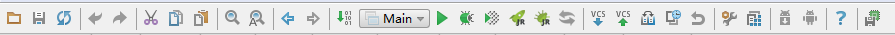

# Intellij IDEA 菜单和界面的介绍

### 首界面
> 
 显示工具条和状态条：View ->ToolBar,Tool Buttons
1.勾选ToolBar 选项会显示当前项目上的工具栏
2.勾选tool Button 选项会显现一些常用的功能：例如maven .dataBase.Structre
> 

### Intellij IDEA 主界面 介绍
官方原文地址：<https://www.jetbrains.com/idea/help/guided-tour-around-intellij-idea-user-interface.html>
> 
1.Menus and toolbars  - 主菜单和工具栏让你执行各种命令。
2.Navigation bar   - 导航栏帮助导航项目和打开的文件进行编辑
3.The status bar  - 状态条（显示您的项目的状态,整个IDE,并显示各种警告和信息消息。）
4.The editor  - 代码编辑区（在这里你创建和修改代码。）
5.IntelliJ IDEA tool windows  - 工具窗口

#### 1.Menus and toolbars  主菜单和工具栏

#### 2.Navigation bar  导航栏
官方原文地址:<https://www.jetbrains.com/idea/help/navigation-bar.html>

#### 3.The status bar 状态条
官方原文地址：<https://www.jetbrains.com/idea/help/status-bar.html>
> 

| 图标                                                           | 描述   |
| --------                                                     : | -----:    |
||  未完成  |
|          |  未完成  |
|        |  未完成  |
|           |  未完成  |
|     |  未完成  |
|        |  未完成  |
|          |  未完成  |
|           |  未完成  |
|        |  未完成  |
|          |  未完成  |
|     |  未完成  |

#### 3.The editor 代码编辑区
官方原文地址：<https://www.jetbrains.com/idea/help/intellij-idea-editor-guided-tour.html>
> 

| 英文名称                            | 中文名称   |  描述   |
| --------                           | -----:    | :----:  |
|1. Editor area                      | 编辑区域   |   使用这个区域输入和编辑您的源代码     |
|2. Gutter area                      | 槽区域     |  提供了额外的信息并显示识别的各种图标的代码结构、书签、断点、指标范围,改变标记和代码折叠线,让你隐藏任意代码块。    |
|3. Smart completion pop-up          | 代码提示框  |  编辑辅助功能，匹配方法名称,功能,标签和其他关键字    |
|4. Document tabs                    | 文档标签    |  启用快速导航在你正在做的多个文档。点击一个标签将其内容并使它可供编辑面前的活跃的编辑器|
|5. Validation side bar / marker bar | 校验侧边栏/标记栏|对应右编辑区域显示的校验条,检查你的代码是否准确,包含错误或警告。这个校验条有红色,黄色,白色,绿色和蓝色等,点击对应的校验条能让你准确跳转到错误的代码,更改行,搜索结果,或TODO标记   |

### ToolBar 工具栏
> 

### Tool button 工具按钮
| 最右边                            | 最左边   |
| --------                           | -----:    |
|||
最底部
> 

### Setting 配置
> 
> Setting 配置模块的分类和说明

| 模板                            | 说明   |
| --------                           | -----:    |
|1.Apperance&Behavior         | 界面的显示和行为操作（比如主题的选择，配置代理）  |
|2.Keymap                     | 快捷键的配置  |
|3.Editor                     | 编辑区域的配置（比如代码提示的设置，模板的设置，项目的字符集设置等，使用频率最高）  |
|4.Plugins                    | 插件的配置（开启，关闭,安装，装卸插件） |
|5.Version Control            | 版本控制（比如SVN,git的配置）|
|6.Build,Execution,Deployment | 项目构建，执行，发布(比如tomcat等服务器的配置，maven的配置，JDK的配置等) |
|7.Languages&Frameworks       | 语言和框架的支持 |
|8.Tools                      | 工具（比如命令终端，CSS和JS代码压缩） |
|9.JRebel                     | 热部署（安装JRebel插件才会有这个配置） |
|10.Other Settings            | 其他设置  |

#### 常见配置模块的使用分布图
#### 1.Appearance&Behavior
######  ⑴. Appearance
######  ⑵. System Settings
* 1.HTTp Proxy
* 2.Upadtes

#### 2.Keymap (快捷键)

#### 3.Editor (代码编辑)
######  ⑴. General
* 1.Smart Keys
* 2.Appearance
* 3.Editor Tabs
* 4.Code Folding
* 5.Code Completions
* 6.Auto Import
* 7.Postfix Completion
* 8.Console Folding

###### ⑵. Color&Fonts (代码颜色和字体)
* 1.Font
* 2.General
* 3.Java
* 4.File Status

###### ⑶. Code Style (代码样式)
* 1.Java
* 2.CSS
* 3.HTML
* 4.JavaScript

###### ⑷. Inspections (代码检查)
###### ⑸. File and Code Templates (文件模板)
###### ⑹. File Encodings (项目和文件编码)
###### ⑺. Live Templates (自定义代码块模板)
###### ⑻. File Types (文件类型)
###### ⑼. Coyperight (版本号)
###### ⑽. Emmet
###### ⑾. Spelling (英文单词拼写检查)
###### ⑿. TODO (TODO 标记)

#### 4.Plugins （插件管理）

#### 5.Version Control （版本控制）
###### ⑴. Confirmation (版本控制的配置)
###### ⑵. Background
###### ⑶. Ignored File (忽视的文件)
###### ⑷. GitHub
###### ⑸. Subversion (SVN)
###### ⑹. Git

#### 6.Build,Execution,Deployment (项目构建，执行，发布管理)
###### ⑴. Build  Tools (项目构建工具)
* 1.Maven
* 2.Gradle

###### ⑵. Compiler (代码编译器)
* 1.Excludes (排序编译目录)
* 2.Java Compiler (Java 编译器)
* 3.Groovy Compiler （Groovy 编译器）
* 4.Gradle-Android Compiler （由Gradle 构建的Android编译器）
* 5.Android Compilers （Android编译器）

###### ⑶. Deployment （项目发布管理）
###### ⑷. Debugger   （debug管理）

#### 7.Languages&Frameworks
###### ⑴. JavaSript
* 1.Libaries （Js库）

###### ⑵. Schemas And DTDS
* 1.XML Catalog

####  8.Tools
###### ⑴. Web Browsers （浏览器配置）
###### ⑵. File Wathers
###### ⑶. Terminal （命令行终端）
###### ⑷. DataBase
###### ⑸. SSH Terminal  (SSH 终端)
###### ⑹. DataBase Navigator (数据库管理)
###### ⑺. Tasks （命令行管理）
####  9.JRebel (热部署插件)

#### 10.Other Settings
###### ⑴. QAPlug (QA检查插件)

### Project Structure 工程结构 窗口

### Project 窗口
### Structure 窗口
### Ant 窗口
### Maven 窗口
### Gradle 窗口
### DateBase 窗口
### JRebel 窗口
### Persistence 窗口
### DB Broweser 窗口
### Run 窗口
### Debug 窗口
### Version Control 窗口
### Terminal 窗口
### TODO 窗口
### Find 窗口
### Terminal 窗口
### Message 窗口
### Problems 窗口

### 对不起，教程还没有，耐性等待一下，已经加班加点在做了。

