Intellij Colors: DSmart
=========================================

Dark color theme for Intellij inspired by DSmart Theme. Also works in other Jetbrains products including Webstorm, PyCharm, RubyMine, and PhPStorm.

To install
> ##### install the font:[Menlo ](DSmart/font/installFont.md)
> ##### Intellij -> creat new theme

  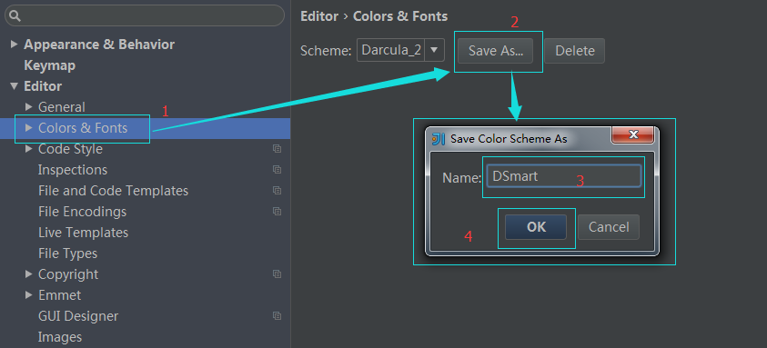
> ##### copy [DSmart.icls](DSmart/DSmart.icls) file to new theme file:C:\Users\{Administrator}\.IntelliJIdea14\config\colors

  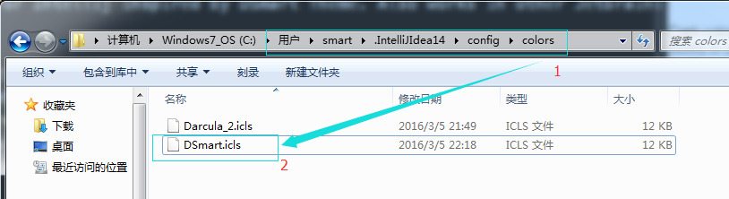
> #####  Copy the content except the first line

   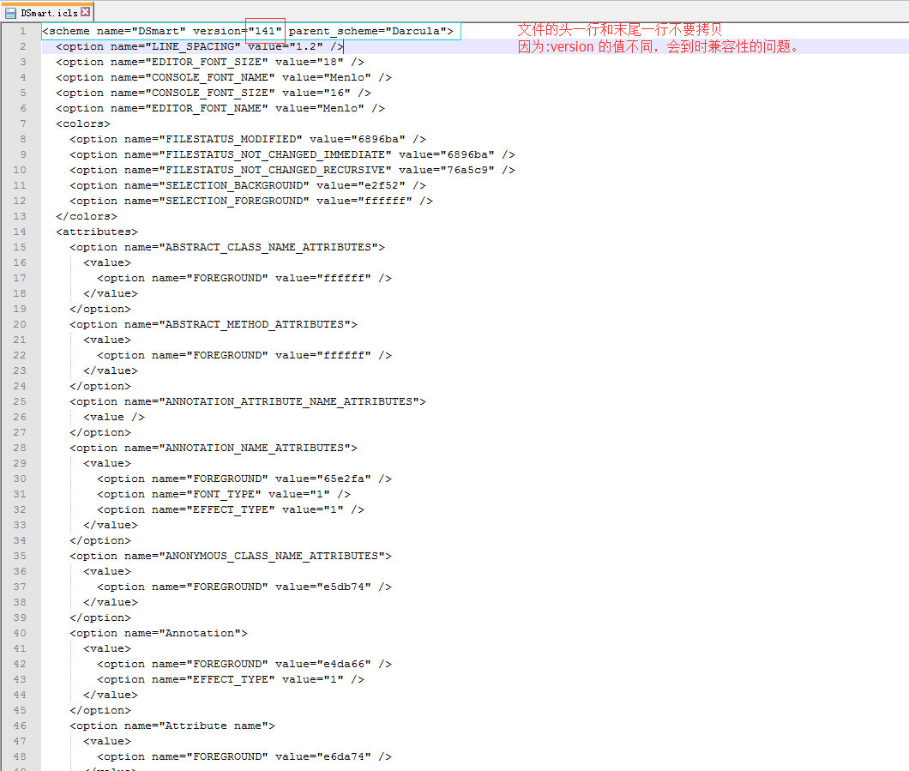

## Supported Languages:
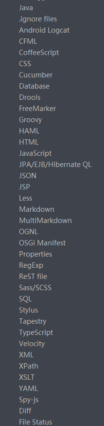

To request support for a language, please fork, create a code sample in the code-samples folder, then create a pull request. I will review it and create a scheme. Feel free to PR your own version for a language.

## Screenshots

> *   JAVA
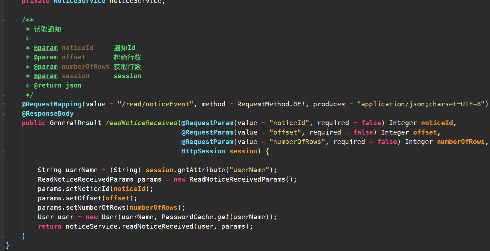
> *   JAVA
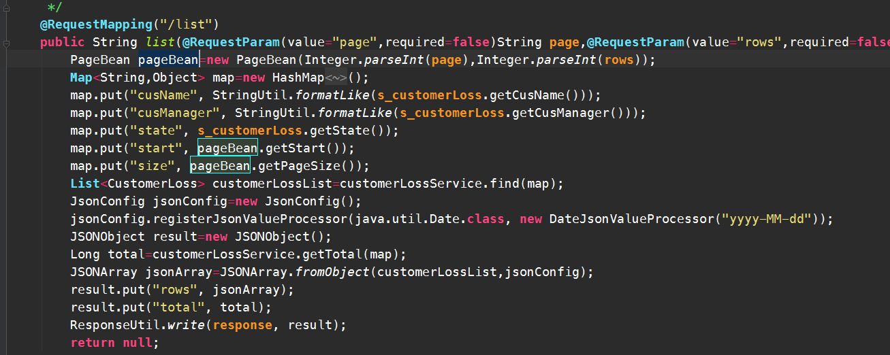
> *   JAVA

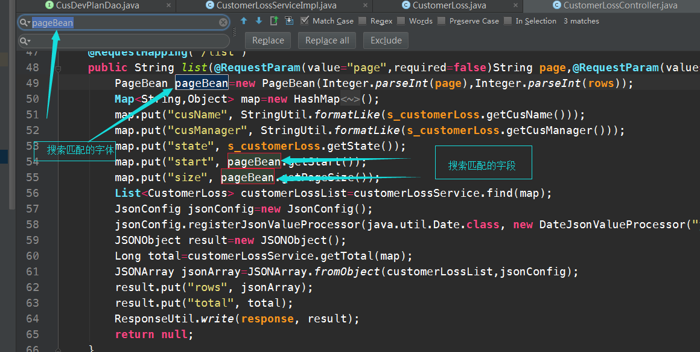
> *   HTML

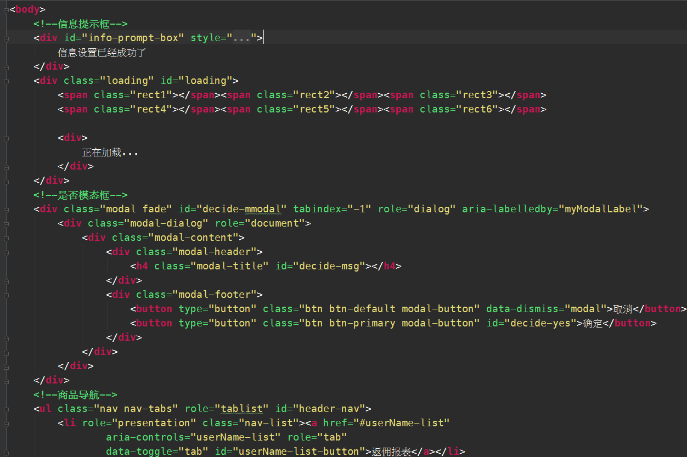
> *   JavaSrcipt

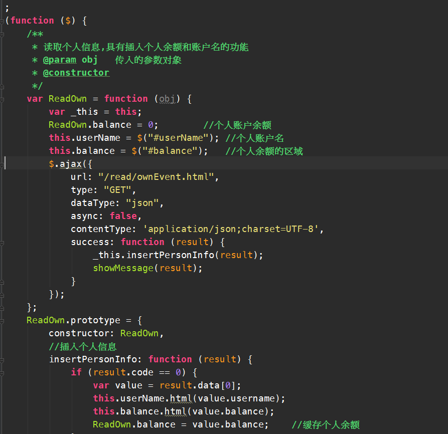
> *   css

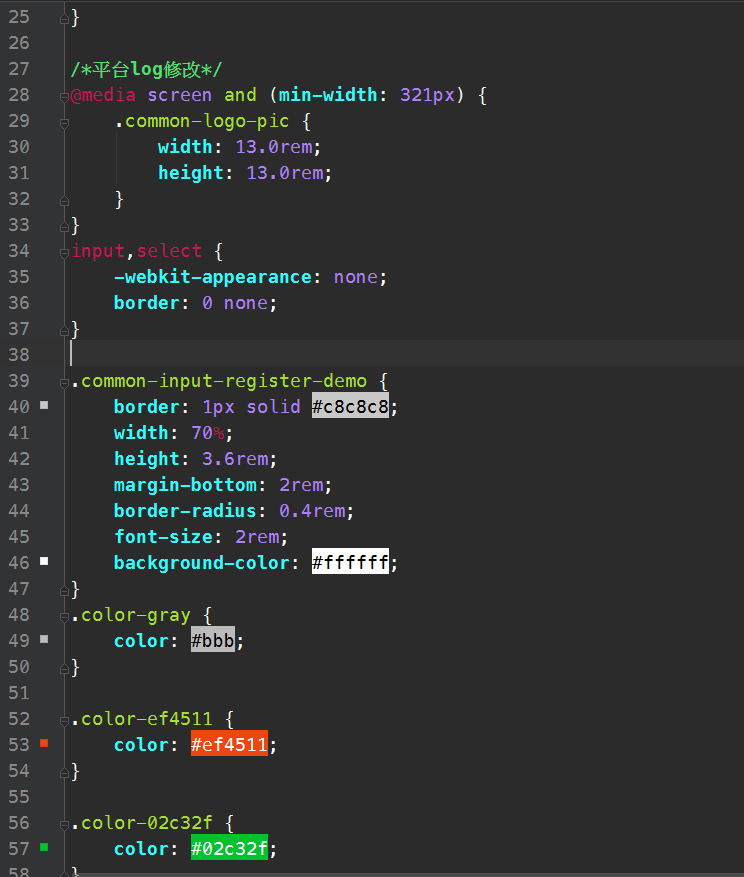

> *   Properties

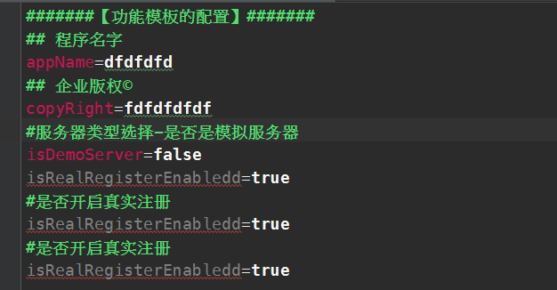

> *   SQL

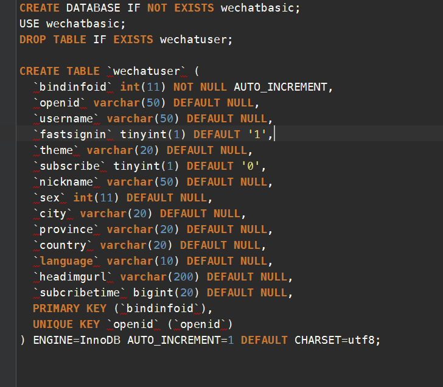

> *   XML
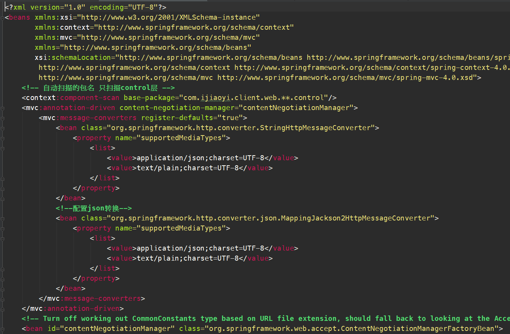

